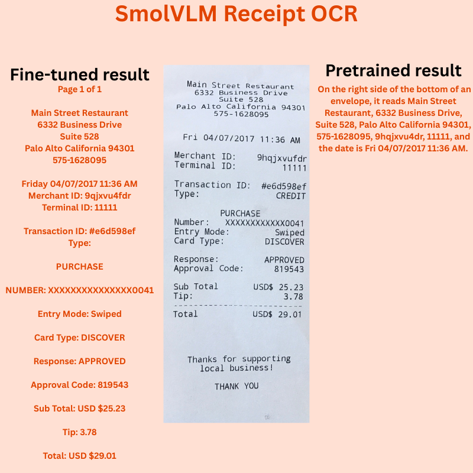

# README

Fine-tuned SmolVLM models for receipt OCR with limited compute.



## Setup SROIE v2 Dataset

Download the SROIE v2 dataset from [here on Kaggle](https://www.kaggle.com/datasets/urbikn/sroie-datasetv2).

Move it to the input directory and if needed rename the parent directory of the downloaded dataset so that the structure looks like this:

```
input/sroie_v2/
└── SROIE2019
    ├── test
    │   ├── box  [347 entries exceeds filelimit, not opening dir]
    │   ├── entities  [347 entries exceeds filelimit, not opening dir]
    │   └── img  [347 entries exceeds filelimit, not opening dir]
    └── train
        ├── box  [626 entries exceeds filelimit, not opening dir]
        ├── entities  [626 entries exceeds filelimit, not opening dir]
        └── img  [626 entries exceeds filelimit, not opening dir]
```

Here, the parent dataset directory has been renamed to `sroie_v2` for easier access.

## Resources

* [Extending TrOCR for Text Localization-Free OCR of Full-Page Scanned Receipt Images](https://openaccess.thecvf.com/content/ICCV2023W/RCV/papers/Zhang_Extending_TrOCR_for_Text_Localization-Free_OCR_of_Full-Page_Scanned_Receipt_ICCVW_2023_paper.pdf)
* [A Comprehensive Evaluation of TrOCR with Varying Image Effects](https://nhsjs.com/wp-content/uploads/2024/11/A-Comprehensive-Evaluation-of-TrOCR-with-Varying-Image-Effects.pdf)

## Data Credits

* `input/`
  * `sroie2019`: https://drive.google.com/drive/folders/1ShItNWXyiY1tFDM5W02bceHuJjyeeJl2
  * `sroie_v2`: https://www.kaggle.com/datasets/urbikn/sroie-datasetv2

## OCR Datasets

* [OCR Receipts Text Detection - retail dataset](https://www.kaggle.com/datasets/trainingdatapro/ocr-receipts-text-detection)
* [CORU: Comprehensive Post-OCR Parsing and Receipt Understanding Dataset](https://github.com/Update-For-Integrated-Business-AI/CORU/tree/main)
  * [Paper](https://arxiv.org/pdf/2406.04493v1)
* [CORDv2](https://huggingface.co/datasets/naver-clova-ix/cord-v2)
  * [Paper](https://openreview.net/pdf?id=SJl3z659UH)
* [FREE Receipt Images – OCR / Machine Learning Dataset](https://expressexpense.com/blog/free-receipt-images-ocr-machine-learning-dataset/)
* 